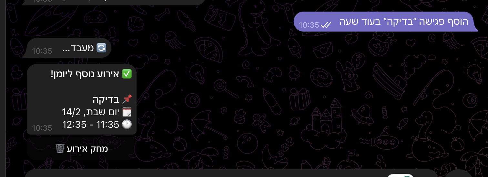
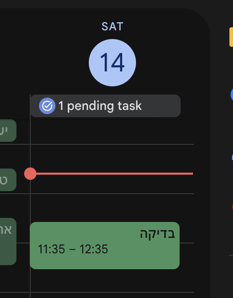

<div align="center">

# Telegram Calendar Bot

[](https://opensource.org/licenses/MIT)
[](https://www.typescriptlang.org/)
[](https://workers.cloudflare.com/)

**בוט טלגרם שמכניס אירועים ליומן Google שלך מטקסט חופשי או הודעה קולית, באמצעות AI.**

[English](#english) · [עברית](#hebrew)

</div>

---

<a id="hebrew"></a>

## למה בניתי את זה?

קיבלת הודעה על **יומולדת בגן** של הילד? **מסיבה בעבודה**? רוצה להזכיר לעצמך לעשות משהו **ביום שישי**?

עכשיו זה קל — **שלח הודעה לבוט, והאירוע נכנס ליומן.**

פשוט תעשה פורוורד של ההודעה, תכתוב בשפה חופשית, או תשלח הודעה קולית — והבוט ידאג להכל.

<p align="center">
  
  &nbsp;&nbsp;&nbsp;
  
</p>

### איך זה עובד?

```
אתה שולח: "פגישה עם דני מחר ב-15:00"
   ↓
הבוט מפענח עם AI → יוצר אירוע ביומן → מאשר בטלגרם ✅
```

### מה הבוט יודע לעשות?

| שלח לבוט | מה קורה |
|---|---|
| `פגישה עם דני מחר ב-15:00` | אירוע מחר 15:00-16:00 |
| `יומולדת של יואב ביום שישי ב-17:00 בפארק` | אירוע ביום שישי הקרוב עם מיקום |
| `תזכיר לי בעוד שעה לצלצל לרופא` | אירוע בעוד שעה מעכשיו |
| `Team sync Monday 10am` | עובד גם באנגלית |
| 🎤 הודעה קולית | מתמלל ויוצר אירוע |

כל אירוע מגיע עם **כפתור מחיקה** למקרה שטעית.

---

## מדריך התקנה

> 💡 **טיפ:** אם אתה עובד עם **Cursor / Claude**, אתה יכול פשוט להדביק את המדריך הזה ולבקש מה-AI לעשות את הצעדים בשבילך.

### מה צריך מראש?

| שירות | מה צריך | עלות |
|---|---|---|
| [Cloudflare](https://dash.cloudflare.com/sign-up) | חשבון + Workers | חינם |
| [Telegram](https://t.me/BotFather) | בוט חדש | חינם |
| [Google Cloud](https://console.cloud.google.com/) | פרויקט + Calendar API | חינם |
| [OpenAI](https://platform.openai.com/api-keys) | מפתח API | ~$0.001 לאירוע |
| Node.js 18+ | מותקן מקומית | — |

---

### שלב 1: יצירת בוט טלגרם

<details>
<summary><b>📱 לחץ לפתיחת ההוראות</b></summary>

1. פתח טלגרם ושלח הודעה ל-[@BotFather](https://t.me/BotFather)
2. שלח `/newbot` ועקוב אחרי ההוראות
3. שמור את ה-**Bot Token** (נראה ככה: `123456789:ABCdefGHIjklMNOpqrsTUVwxyz`)
4. שלח הודעה כלשהי לבוט החדש שלך, ואז גש ל:
   ```
   https://api.telegram.org/bot<TOKEN>/getUpdates
   ```
5. מצא את ה-**Chat ID** שלך בתשובה (`"chat":{"id":123456789}`)

</details>

---

### שלב 2: הגדרת Google Cloud

<details>
<summary><b>☁️ לחץ לפתיחת ההוראות</b></summary>

1. גש ל-[Google Cloud Console](https://console.cloud.google.com/) וצור פרויקט חדש
2. **הפעל את Google Calendar API:**
   - **APIs & Services → Library**
   - חפש "Google Calendar API"
   - לחץ **Enable**
3. **צור OAuth credentials:**
   - **APIs & Services → Credentials**
   - **Create Credentials → OAuth client ID**
   - סוג: **Web application**
   - הוסף Redirect URI:
     ```
     https://telegram-calendar-bot.YOUR_SUBDOMAIN.workers.dev/oauth/callback
     ```
   - שמור את ה-**Client ID** וה-**Client Secret**
4. **הגדר OAuth consent screen:**
   - **APIs & Services → OAuth consent screen**
   - בחר **External**
   - הוסף את המייל שלך כ-**Test user**

</details>

---

### שלב 3: התקנה ודיפלוי

<details>
<summary><b>🚀 לחץ לפתיחת ההוראות</b></summary>

```bash
# שכפל את הפרויקט
git clone https://github.com/ofershap/telegram-calendar-bot.git
cd telegram-calendar-bot

# התקן תלויות
npm install

# התחבר ל-Cloudflare
npx wrangler login

# צור KV namespace
npx wrangler kv namespace create KV
# ← העתק את ה-ID שמוחזר
```

צור קובץ `wrangler.toml`:

```toml
name = "telegram-calendar-bot"
main = "src/index.ts"
compatibility_date = "2025-12-01"

[[kv_namespaces]]
binding = "KV"
id = "YOUR_KV_NAMESPACE_ID"   # ← הדבק את ה-ID מלמעלה
```

הגדר את הסודות:

```bash
echo "BOT_TOKEN" | npx wrangler secret put TELEGRAM_BOT_TOKEN
echo "CHAT_ID" | npx wrangler secret put TELEGRAM_CHAT_ID
echo "OPENAI_KEY" | npx wrangler secret put OPENAI_API_KEY
echo "CLIENT_ID" | npx wrangler secret put GOOGLE_CLIENT_ID
echo "CLIENT_SECRET" | npx wrangler secret put GOOGLE_CLIENT_SECRET
echo "primary" | npx wrangler secret put GOOGLE_CALENDAR_ID
echo "https://telegram-calendar-bot.YOUR_SUBDOMAIN.workers.dev" | npx wrangler secret put WORKER_URL
```

דיפלוי:

```bash
npm run deploy
```

</details>

---

### שלב 4: חיבור Webhook

```bash
curl -X POST "https://api.telegram.org/bot<TOKEN>/setWebhook" \
  -H "Content-Type: application/json" \
  -d '{"url": "https://telegram-calendar-bot.YOUR_SUBDOMAIN.workers.dev/webhook"}'
```

### שלב 5: חיבור Google Calendar

שלח הודעה כלשהי לבוט — הוא ישלח לך לינק לחיבור חשבון Google. לחץ, אשר, וסיימת.

---

## ארכיטקטורה

```
Telegram  →  Cloudflare Worker  →  OpenAI GPT-4o-mini  →  Google Calendar API
                                →  OpenAI Whisper (תמלול קולי)
```

| רכיב | תפקיד |
|---|---|
| **Hono** | Web framework קליל |
| **Cloudflare Workers** | Serverless, אפס cold starts |
| **Cloudflare KV** | שמירת OAuth tokens |
| **OpenAI GPT-4o-mini** | פענוח טקסט חופשי לאירוע |
| **OpenAI Whisper** | תמלול הודעות קוליות |
| **Google Calendar API** | יצירה ומחיקה של אירועים |

## מבנה הפרויקט

```
src/
├── index.ts       # נתיבי Hono (webhook, OAuth, status)
├── handlers.ts    # טיפול בהודעות ויצירת אירועים
├── ai.ts          # OpenAI — פענוח טקסט + תמלול
├── google.ts      # Google Calendar API + ניהול OAuth tokens
├── telegram.ts    # Telegram Bot API helpers
└── types.ts       # TypeScript interfaces
```

## עלויות

| שירות | עלות |
|---|---|
| Cloudflare Workers | חינם (100K בקשות/יום) |
| Cloudflare KV | חינם (100K קריאות/יום) |
| OpenAI GPT-4o-mini | ~₪0.003 לאירוע |
| OpenAI Whisper | ~₪0.02 לדקת קול |
| Google Calendar API | חינם |

**שימוש אישי עולה פחות מ-₪3 בחודש.**

---

## פיתוח מקומי

```bash
cp wrangler.example.toml wrangler.toml
# ערוך את wrangler.toml עם ה-KV ID שלך
```

צור קובץ `.dev.vars`:

```
TELEGRAM_BOT_TOKEN=your_token
TELEGRAM_CHAT_ID=your_chat_id
OPENAI_API_KEY=your_key
GOOGLE_CLIENT_ID=your_client_id
GOOGLE_CLIENT_SECRET=your_secret
GOOGLE_CALENDAR_ID=primary
WORKER_URL=https://your-worker.workers.dev
```

```bash
npm run dev
```

---

<a id="english"></a>

## English

A Telegram bot that creates Google Calendar events from natural language messages and voice notes, powered by AI. Runs on Cloudflare Workers.

Send a message like **"Meeting with Dan tomorrow at 3pm"** or a voice note, and it instantly appears in your Google Calendar.

### Quick Start

1. **Clone** — `git clone https://github.com/ofershap/telegram-calendar-bot.git`
2. **Create a Telegram bot** — Message [@BotFather](https://t.me/BotFather), get a token
3. **Set up Google Cloud** — Create project, enable Calendar API, create OAuth credentials
4. **Deploy to Cloudflare** — `npm install && npx wrangler login && npm run deploy`
5. **Set secrets** — Use `npx wrangler secret put` for each env var
6. **Register webhook** — `curl` to Telegram's `setWebhook` endpoint
7. **Connect Google** — Send a message to the bot, click the auth link

See the [Hebrew guide above](#hebrew) for detailed step-by-step instructions.

### Features

- **Natural language** — "Meeting tomorrow at 3pm", "Birthday party Friday at 5"
- **Voice messages** — Send a voice note, it gets transcribed and parsed
- **Relative time** — "in an hour", "next Monday" — all work
- **Multi-language** — Hebrew, English, and more
- **Delete from chat** — Each event has a delete button
- **Serverless** — Cloudflare Workers free tier, zero cold starts

### Environment Variables

| Variable | Description |
|---|---|
| `TELEGRAM_BOT_TOKEN` | Bot token from BotFather |
| `TELEGRAM_CHAT_ID` | Your Telegram chat ID |
| `OPENAI_API_KEY` | OpenAI API key |
| `GOOGLE_CLIENT_ID` | Google OAuth client ID |
| `GOOGLE_CLIENT_SECRET` | Google OAuth client secret |
| `GOOGLE_CALENDAR_ID` | Calendar ID (`primary` for main calendar) |
| `WORKER_URL` | Your deployed worker URL |

---

## License

[MIT](LICENSE) &copy; [Ofer Shapiria](https://github.com/ofershap)
